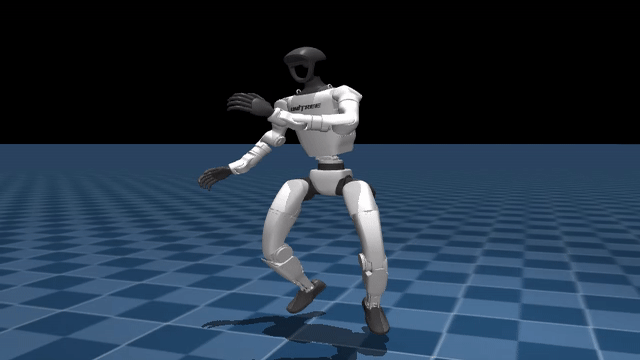
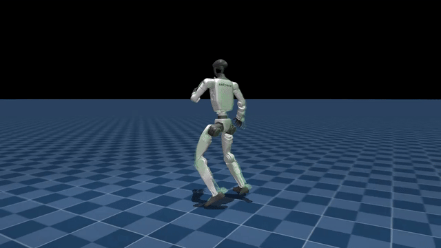
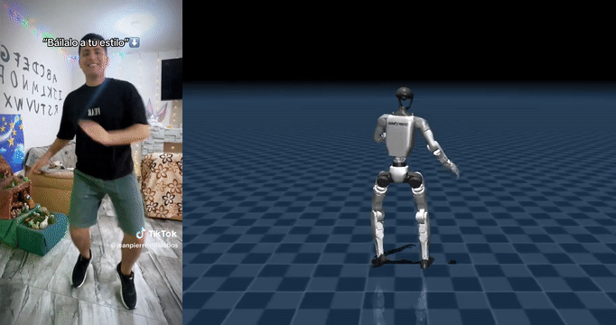
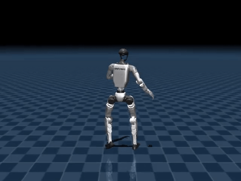

# G1 Body29 Tracking Pipeline

Single-clip motion tracking for `Unitree G1` body-only `29 DoF`, from `video2robot` output to `mjlab` training and `RoboJuDo` sim2sim.

This repo packages the exact local workflow we used for `video_005`:

- validate `video2robot` output
- convert it into `motion.npz`
- train a `mjlab` tracking policy
- export an actor-only ONNX
- replay the same policy in a `g1-moves` / `RoboJuDo`-style sim2sim stack

The repo is intentionally lightweight:

- our code and docs live here
- upstreams are cloned on demand
- local `mjlab` changes are carried as a patch in [`patches/mjlab-body29-local-flow.patch`](patches/mjlab-body29-local-flow.patch)

## TL;DR

- input clip: `video_005`
- active task: `Mjlab-Tracking-Flat-Unitree-G1-G1MovesCompat`
- training stack: `mjlab` + PPO
- deploy / sim2sim stack: `RoboJuDo`-style MuJoCo XML + ONNX metadata
- best current sim2sim checkpoint: `model_14000.pt`
- final long run stalled near the end around iteration `14811`, so we selected the best saved checkpoint from the completed artifacts instead of forcing a broken resume

## Visual Results

GitHub renders GIFs inline, so the key artifacts are embedded directly below. The MP4 versions are also committed for download.

### 1. Original TikTok / input clip

[](docs/media/videos/video_005_original_tiktok.mp4)

### 2. Converted reference motion used for training

[](docs/media/videos/video_005_reference_motion.mp4)

### 3. Representative `mjlab` rollout

[](docs/media/videos/video_005_mjlab_model_8000.mp4)

### 4. Original clip vs robot side by side

This is the most important visual for quick review: source video on the left, best current RoboJuDo transfer on the right.



### 5. Robot-only RoboJuDo rollout

[](docs/media/videos/video_005_robojudo_model_14000.mp4)

## What This Repo Contains

- [`body29_pipeline`](body29_pipeline)
  - local CLI for validate / convert / train / evaluate / rollout / ONNX export
- [`patches/mjlab-body29-local-flow.patch`](patches/mjlab-body29-local-flow.patch)
  - local `mjlab` changes required for this workflow
- [`scripts/bootstrap_upstreams.sh`](scripts/bootstrap_upstreams.sh)
  - clones pinned upstreams and applies the `mjlab` patch
- [`scripts/apply_mjlab_patch.sh`](scripts/apply_mjlab_patch.sh)
  - reapplies the patch on an existing `mjlab` checkout
- [`docs/results`](docs/results)
  - frozen metric snapshots copied from the local run
- [`docs/media`](docs/media)
  - README media assets committed into the repo

## Pipeline Overview

1. `video2robot` produces `robot_motion.csv` and `robot_motion.pkl`
2. we validate the bundle and convert it to `motion.npz`
3. we replay the reference motion in `mjlab`
4. we train a single-clip PPO policy in `mjlab`
5. we evaluate checkpoints inside `mjlab`
6. we export an actor-only ONNX
7. we run the ONNX in a `RoboJuDo` sim2sim loop using ONNX metadata for control
8. we pick the best checkpoint based on transfer, not only in-simulator metrics

## Input Format

The repo expects:

```text
00_RL_input/video_005/
  robot_motion.csv
  robot_motion.pkl
```

For this project, the CSV is the source of truth for training:

- shape: `172 x 36`
- layout: `root_pos(3) + root_quat_xyzw(4) + dof_pos(29)`

The PKL is kept as an audit/debug artifact.

## Exact Process We Followed

### 1. Bootstrap

```bash
python3 -m pip install -e .
bash scripts/bootstrap_upstreams.sh
```

Pinned upstreams are recorded in [`upstreams/lock.json`](upstreams/lock.json).

### 2. Validate And Convert

```bash
python3 -m body29_pipeline.cli validate --strict
python3 -m body29_pipeline.cli convert --render
```

That produces:

- `artifacts/video_005/motion.npz`
- `artifacts/video_005/motion.mp4`

### 3. Smoke Training

Before the long run, we use a smoke run to verify:

- task builds
- PPO loop runs
- checkpoints save
- ONNX export works
- rollout scripts work

```bash
python3 -m body29_pipeline.cli smoke-train \
  --task-id Mjlab-Tracking-Flat-Unitree-G1-G1MovesCompat \
  --iterations 100 \
  --num-envs 64 \
  --save-interval 50 \
  --run-name smoke_video_005_g1_moves_compat
```

### 4. Long Training Run

The main run was:

```bash
python3 -m body29_pipeline.cli train \
  --task-id Mjlab-Tracking-Flat-Unitree-G1-G1MovesCompat \
  --motion-file artifacts/video_005/motion.npz \
  --iterations 15000 \
  --num-envs 2048 \
  --save-interval 2000 \
  --experiment-name body29dof_g1_moves_compat \
  --run-name train_video_005_g1_moves_compat_long_tty \
  --seed 42
```

The run directory is:

- `research/mjlab/logs/rsl_rl/body29dof_g1_moves_compat/2026-03-28_13-25-21_train_video_005_g1_moves_compat_long_tty`

The saved checkpoints were:

- `model_2000.pt`
- `model_4000.pt`
- `model_6000.pt`
- `model_8000.pt`
- `model_10000.pt`
- `model_12000.pt`
- `model_14000.pt`

The process stalled near the end around iteration `14811`, so the public result selection is based on saved checkpoints, not on an unsaved terminal state.

### 5. Monitoring

We monitored training with TensorBoard:

```bash
tensorboard --logdir research/mjlab/logs/rsl_rl/body29dof_g1_moves_compat
```

The main curves we watched:

- `Train/mean_episode_length`
- `Train/mean_reward`
- `Metrics/motion/error_body_pos`
- `Metrics/motion/error_anchor_pos`
- `Metrics/motion/error_joint_vel`
- `Episode_Termination/ee_body_pos`

### 6. `mjlab` Evaluation

Checkpoint evaluation was done inside `mjlab` before sim2sim:

```bash
python3 -m body29_pipeline.cli evaluate \
  --task-id Mjlab-Tracking-Flat-Unitree-G1-G1MovesCompat \
  --motion-file artifacts/video_005/motion.npz \
  --checkpoint-file research/mjlab/logs/rsl_rl/body29dof_g1_moves_compat/<run>/model_<step>.pt \
  --num-envs 16
```

Representative results:

| Checkpoint | success_rate | mpkpe | r_mpkpe | joint_vel_error | ee_pos_error | ee_ori_error | Source |
| --- | ---: | ---: | ---: | ---: | ---: | ---: | --- |
| `model_8000` | `1.0000` | `0.0482` | `0.0345` | `5.8182` | `0.0713` | `0.2041` | [`docs/results/model_8000_eval.json`](docs/results/model_8000_eval.json) |
| `model_10000` | `1.0000` | `0.0471` | `0.0342` | `5.8426` | `0.0710` | `0.2003` | [`docs/results/model_10000_eval.json`](docs/results/model_10000_eval.json) |

Inside `mjlab`, `8000` and `10000` are both strong. The bigger difference showed up in transfer.

### 7. ONNX Export

We export actor-only ONNX:

```bash
python3 -m body29_pipeline.cli export-onnx \
  --task-id Mjlab-Tracking-Flat-Unitree-G1-G1MovesCompat \
  --checkpoint-file research/mjlab/logs/rsl_rl/body29dof_g1_moves_compat/<run>/model_<step>.pt
```

The ONNX contract is:

- input: `obs`
- output: `actions`

Metadata embedded in the ONNX includes:

- `joint_names`
- `default_joint_pos`
- `action_scale`
- `joint_stiffness`
- `joint_damping`
- `anchor_body_name`
- `body_names`
- `observation_names`

### 8. RoboJuDo Sim2Sim

The active sim2sim route is the `g1-moves` / `RoboJuDo`-style stack, not the old `unitree_mujoco` baseline.

The command pattern is:

```bash
cd research/g1-moves/RoboJuDo
./.venv/bin/python scripts/eval_mjlab_g1moves_robojudo.py \
  --onnx-file /path/to/model.onnx \
  --motion-file /home/raul/00_cursor/RL/artifacts/video_005/motion.npz \
  --xml-file /home/raul/00_cursor/RL/research/g1-moves/RoboJuDo/assets/robots/g1/g1_29dof_rev_1_0.xml \
  --output-video /path/to/output.mp4 \
  --output-metrics /path/to/output.json \
  --action-mode scaled_offset \
  --obs-default metadata \
  --video-width 640 \
  --video-height 480
```

Important detail:

- for our `mjlab`-trained checkpoints, `scaled_offset + metadata` transferred better than the literal `g1-moves` direct-target mode

## Transfer Metrics

These are the metrics that mattered most when choosing the final checkpoint for sim2sim:

| Checkpoint | mpkpe | r_mpkpe | joint_vel_error | anchor_xy_error | anchor_xy_error_max | Source |
| --- | ---: | ---: | ---: | ---: | ---: | --- |
| `model_8000` | `0.1155` | `0.0284` | `4.8246` | `0.1002` | `0.1875` | [`docs/results/robojudo_model_8000_full_scaled.json`](docs/results/robojudo_model_8000_full_scaled.json) |
| `model_10000` | `0.0915` | `0.0275` | `4.7982` | `0.0748` | `0.1601` | [`docs/results/robojudo_model_10000_full_scaled.json`](docs/results/robojudo_model_10000_full_scaled.json) |
| `model_12000` | `0.0936` | `0.0283` | `4.7258` | `0.0758` | `0.1776` | [`docs/results/robojudo_model_12000_full_scaled.json`](docs/results/robojudo_model_12000_full_scaled.json) |
| `model_14000` | `0.0857` | `0.0286` | `4.7900` | `0.0655` | `0.1770` | [`docs/results/robojudo_model_14000_full_scaled.json`](docs/results/robojudo_model_14000_full_scaled.json) |

## How We Selected The Current Best Checkpoint

We did **not** simply pick the last checkpoint.

Selection logic:

1. verify the policy is strong in `mjlab`
2. export ONNX
3. replay in RoboJuDo sim2sim
4. compare `mpkpe`, `anchor_xy_error`, and visual quality
5. prefer the checkpoint that transfers best, even if `mjlab` metrics are all already good

That is why the current recommendation is:

- **best `mjlab` checkpoint among evaluated ones:** `model_10000`
- **best RoboJuDo / sim2sim checkpoint:** `model_14000`

For the actual next step toward real hardware, we currently recommend treating `model_14000` as the primary candidate.

## What We Learned

### 1. Good `mjlab` tracking is necessary but not sufficient

Early on, checkpoints could look good inside `mjlab` and still fail badly in standalone sim2sim because the deployment contract was not yet aligned.

### 2. The deployment contract matters

The important pieces were:

- observation order
- anchor semantics
- default joint pose
- action scaling
- joint stiffness / damping
- XML choice

### 3. RoboJuDo helped more than the old standalone path

Once we switched to a `RoboJuDo`-style loop and used ONNX metadata to build the controller, transfer improved a lot.

### 4. The run ended with a real but non-fatal failure mode

The long training process stalled near the end. We attempted to resume it, but CUDA initialization broke for new PyTorch processes in the current session. Instead of forcing a fragile recovery, we froze the best saved checkpoints and selected the best one empirically.

## Reproduce On A Fresh Machine

```bash
python3 -m pip install -e .
bash scripts/bootstrap_upstreams.sh
python3 -m body29_pipeline.cli validate --strict
python3 -m body29_pipeline.cli convert --render
python3 -m body29_pipeline.cli train \
  --task-id Mjlab-Tracking-Flat-Unitree-G1-G1MovesCompat \
  --motion-file artifacts/video_005/motion.npz \
  --iterations 15000 \
  --num-envs 2048 \
  --save-interval 2000 \
  --experiment-name body29dof_g1_moves_compat \
  --run-name train_video_005_g1_moves_compat_long_tty \
  --seed 42
```

Then:

```bash
python3 -m body29_pipeline.cli evaluate \
  --task-id Mjlab-Tracking-Flat-Unitree-G1-G1MovesCompat \
  --checkpoint-file research/mjlab/logs/rsl_rl/body29dof_g1_moves_compat/<run>/model_10000.pt

python3 -m body29_pipeline.cli export-onnx \
  --task-id Mjlab-Tracking-Flat-Unitree-G1-G1MovesCompat \
  --checkpoint-file research/mjlab/logs/rsl_rl/body29dof_g1_moves_compat/<run>/model_14000.pt
```

Then run RoboJuDo sim2sim as shown above.

## Repo Map

- [`docs/00-overview.md`](docs/00-overview.md)
- [`docs/01-bootstrap.md`](docs/01-bootstrap.md)
- [`docs/02-input-bundle.md`](docs/02-input-bundle.md)
- [`docs/03-training-curriculum.md`](docs/03-training-curriculum.md)
- [`docs/04-evaluation-and-gates.md`](docs/04-evaluation-and-gates.md)
- [`docs/05-sim2sim.md`](docs/05-sim2sim.md)
- [`docs/06-team-checklist.md`](docs/06-team-checklist.md)
- [`docs/07-training-explainer.md`](docs/07-training-explainer.md)
- [`docs/08-results.md`](docs/08-results.md)

## Pinned Upstreams

- `mjlab`: `https://github.com/mujocolab/mjlab`
- `g1-moves`: `https://github.com/experientialtech/g1-moves`
- `RoboJuDo`: bundled as submodule under `g1-moves`
- `TWIST2`: `https://github.com/amazon-far/TWIST2`
- `unitree_mujoco`: `https://github.com/unitreerobotics/unitree_mujoco`

## Notes

- this repo is `body_29dof_only` by design
- Dex3 fingers stay fixed and outside policy / reward / motion reference
- the public route documented here is the route we actually used, not an idealized one
- if you want the raw metric snapshots, they are committed under [`docs/results`](docs/results)
